-   [Wine Exploration Data Analysis](#wine-exploration-data-analysis)
-   [Univariate Plots Section](#univariate-plots-section)
-   [Univariate Analysis](#univariate-analysis)
    -   [What is the structure of your dataset?](#what-is-the-structure-of-your-dataset)
    -   [What is/are the main feature(s) of interest in your dataset?](#what-isare-the-main-features-of-interest-in-your-dataset)
    -   [What other features in the dataset do you think will help support your investigation into your feature(s) of interest?](#what-other-features-in-the-dataset-do-you-think-will-help-support-your-investigation-into-your-features-of-interest)
    -   [Did you create any new variables from existing variables in the dataset?](#did-you-create-any-new-variables-from-existing-variables-in-the-dataset)
    -   [Of the features you investigated, were there any unusual distributions? Did you perform any operations on the data to tidy, adjust, or change the form of the data? If so, why did you do this?](#of-the-features-you-investigated-were-there-any-unusual-distributions-did-you-perform-any-operations-on-the-data-to-tidy-adjust-or-change-the-form-of-the-data-if-so-why-did-you-do-this)
-   [Bivariate Plots Section](#bivariate-plots-section)
-   [Bivariate Analysis](#bivariate-analysis)
    -   [Talk about some of the relationships you observed in this part of the investigation. How did the feature(s) of interest vary with other features in the dataset?](#talk-about-some-of-the-relationships-you-observed-in-this-part-of-the-investigation.-how-did-the-features-of-interest-vary-with-other-features-in-the-dataset)
    -   [Did you observe any interesting relationships between the other features (not the main feature(s) of interest)?](#did-you-observe-any-interesting-relationships-between-the-other-features-not-the-main-features-of-interest)
    -   [What was the strongest relationship you found?](#what-was-the-strongest-relationship-you-found)
-   [Multivariate Plots Section](#multivariate-plots-section)
-   [Multivariate Analysis](#multivariate-analysis)
    -   [Talk about some of the relationships you observed in this part of the investigation. Were there features that strengthened each other in terms of looking at your feature(s) of interest?](#talk-about-some-of-the-relationships-you-observed-in-this-part-of-the-investigation.-were-there-features-that-strengthened-each-other-in-terms-of-looking-at-your-features-of-interest)
    -   [Were there any interesting or surprising interactions between features?](#were-there-any-interesting-or-surprising-interactions-between-features)
    -   [OPTIONAL: Did you create any models with your dataset? Discuss the strengths and limitations of your model.](#optional-did-you-create-any-models-with-your-dataset-discuss-the-strengths-and-limitations-of-your-model.)
-   [Final Plots and Summary](#final-plots-and-summary)
    -   [Plot One](#plot-one)
    -   [Description One](#description-one)
    -   [Plot Two](#plot-two)
    -   [Description Two](#description-two)
    -   [Plot Three](#plot-three)
    -   [Description Three](#description-three)
-   [Reflection](#reflection)

Wine Exploration Data Analysis
==============================

I choose the white wine dataset to perform exploration data analysis. This dataset contains quality and chemical compositions for 4898 white wine.

Univariate Plots Section
========================

    ## [1] 4898   13

    ## 'data.frame':    4898 obs. of  13 variables:
    ##  $ X                   : int  1 2 3 4 5 6 7 8 9 10 ...
    ##  $ fixed.acidity       : num  7 6.3 8.1 7.2 7.2 8.1 6.2 7 6.3 8.1 ...
    ##  $ volatile.acidity    : num  0.27 0.3 0.28 0.23 0.23 0.28 0.32 0.27 0.3 0.22 ...
    ##  $ citric.acid         : num  0.36 0.34 0.4 0.32 0.32 0.4 0.16 0.36 0.34 0.43 ...
    ##  $ residual.sugar      : num  20.7 1.6 6.9 8.5 8.5 6.9 7 20.7 1.6 1.5 ...
    ##  $ chlorides           : num  0.045 0.049 0.05 0.058 0.058 0.05 0.045 0.045 0.049 0.044 ...
    ##  $ free.sulfur.dioxide : num  45 14 30 47 47 30 30 45 14 28 ...
    ##  $ total.sulfur.dioxide: num  170 132 97 186 186 97 136 170 132 129 ...
    ##  $ density             : num  1.001 0.994 0.995 0.996 0.996 ...
    ##  $ pH                  : num  3 3.3 3.26 3.19 3.19 3.26 3.18 3 3.3 3.22 ...
    ##  $ sulphates           : num  0.45 0.49 0.44 0.4 0.4 0.44 0.47 0.45 0.49 0.45 ...
    ##  $ alcohol             : num  8.8 9.5 10.1 9.9 9.9 10.1 9.6 8.8 9.5 11 ...
    ##  $ quality             : int  6 6 6 6 6 6 6 6 6 6 ...

    ##        X        fixed.acidity    volatile.acidity  citric.acid    
    ##  Min.   :   1   Min.   : 3.800   Min.   :0.0800   Min.   :0.0000  
    ##  1st Qu.:1225   1st Qu.: 6.300   1st Qu.:0.2100   1st Qu.:0.2700  
    ##  Median :2450   Median : 6.800   Median :0.2600   Median :0.3200  
    ##  Mean   :2450   Mean   : 6.855   Mean   :0.2782   Mean   :0.3342  
    ##  3rd Qu.:3674   3rd Qu.: 7.300   3rd Qu.:0.3200   3rd Qu.:0.3900  
    ##  Max.   :4898   Max.   :14.200   Max.   :1.1000   Max.   :1.6600  
    ##  residual.sugar     chlorides       free.sulfur.dioxide
    ##  Min.   : 0.600   Min.   :0.00900   Min.   :  2.00     
    ##  1st Qu.: 1.700   1st Qu.:0.03600   1st Qu.: 23.00     
    ##  Median : 5.200   Median :0.04300   Median : 34.00     
    ##  Mean   : 6.391   Mean   :0.04577   Mean   : 35.31     
    ##  3rd Qu.: 9.900   3rd Qu.:0.05000   3rd Qu.: 46.00     
    ##  Max.   :65.800   Max.   :0.34600   Max.   :289.00     
    ##  total.sulfur.dioxide    density             pH          sulphates     
    ##  Min.   :  9.0        Min.   :0.9871   Min.   :2.720   Min.   :0.2200  
    ##  1st Qu.:108.0        1st Qu.:0.9917   1st Qu.:3.090   1st Qu.:0.4100  
    ##  Median :134.0        Median :0.9937   Median :3.180   Median :0.4700  
    ##  Mean   :138.4        Mean   :0.9940   Mean   :3.188   Mean   :0.4898  
    ##  3rd Qu.:167.0        3rd Qu.:0.9961   3rd Qu.:3.280   3rd Qu.:0.5500  
    ##  Max.   :440.0        Max.   :1.0390   Max.   :3.820   Max.   :1.0800  
    ##     alcohol         quality     
    ##  Min.   : 8.00   Min.   :3.000  
    ##  1st Qu.: 9.50   1st Qu.:5.000  
    ##  Median :10.40   Median :6.000  
    ##  Mean   :10.51   Mean   :5.878  
    ##  3rd Qu.:11.40   3rd Qu.:6.000  
    ##  Max.   :14.20   Max.   :9.000

The dataset contains 13 variables and almost 5000 observations, no NAs existed. Not all variables are helpful for analyzing. According to the specifications in wineQualityInfo.txt, I will create a new variable called bound.sulfur.dioxide defined as total.sulfur.dioxide minus free.sulfur.dioxide.

I will create two categorical variables called sweet\_level and quality\_level. According to [Wikipedia](https://en.wikipedia.org/wiki/Sweetness_of_wine#Residual_sugar), a wine can be classified as four levels: dry(up to 4 *g*/*d**m*3), medium dry(up to 12 *g*/*d**m*3), medium(up to 45 *g*/*d**m*3) and sweet(more than 45 *g*/*d**m*3) by sweetness; the quality ranges from 3 to 9 and 6 is the median, so I will classify the quality into three types: low(qualities of 3, 4 and 5), medium(quality of 6) and high(quanlity of 7, 8 and 9), this may do some help for analyzing.

And this is the new structure.

    ## 'data.frame':    4898 obs. of  14 variables:
    ##  $ quality             : int  6 6 6 6 6 6 6 6 6 6 ...
    ##  $ quality_level       : Ord.factor w/ 3 levels "low"<"medium"<..: 2 2 2 2 2 2 2 2 2 2 ...
    ##  $ fixed.acidity       : num  7 6.3 8.1 7.2 7.2 8.1 6.2 7 6.3 8.1 ...
    ##  $ volatile.acidity    : num  0.27 0.3 0.28 0.23 0.23 0.28 0.32 0.27 0.3 0.22 ...
    ##  $ citric.acid         : num  0.36 0.34 0.4 0.32 0.32 0.4 0.16 0.36 0.34 0.43 ...
    ##  $ residual.sugar      : num  20.7 1.6 6.9 8.5 8.5 6.9 7 20.7 1.6 1.5 ...
    ##  $ sugar_level         : Ord.factor w/ 4 levels "dry"<"medium dry"<..: 3 1 2 2 2 2 2 3 1 1 ...
    ##  $ chlorides           : num  0.045 0.049 0.05 0.058 0.058 0.05 0.045 0.045 0.049 0.044 ...
    ##  $ free.sulfur.dioxide : num  45 14 30 47 47 30 30 45 14 28 ...
    ##  $ bound.sulfur.dioxide: num  125 118 67 139 139 67 106 125 118 101 ...
    ##  $ sulphates           : num  0.45 0.49 0.44 0.4 0.4 0.44 0.47 0.45 0.49 0.45 ...
    ##  $ density             : num  1.001 0.994 0.995 0.996 0.996 ...
    ##  $ pH                  : num  3 3.3 3.26 3.19 3.19 3.26 3.18 3 3.3 3.22 ...
    ##  $ alcohol             : num  8.8 9.5 10.1 9.9 9.9 10.1 9.6 8.8 9.5 11 ...

Let's first look at the original qualities

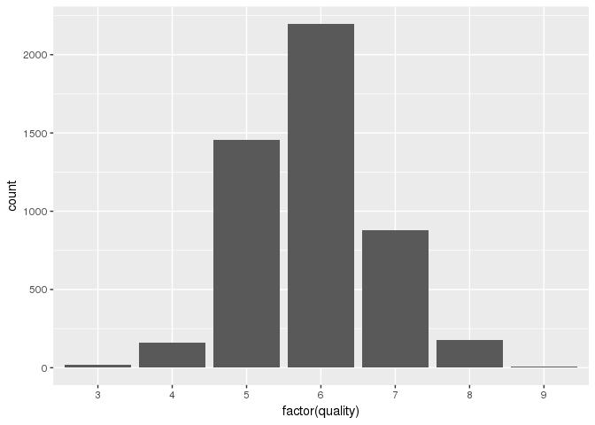

    ## 
    ##    3    4    5    6    7    8    9 
    ##   20  163 1457 2198  880  175    5

    ##    Min. 1st Qu.  Median    Mean 3rd Qu.    Max. 
    ##   3.000   5.000   6.000   5.878   6.000   9.000

From the plot we can see that a majority of wines are of quality 5, 6 and 7. Wines of very high or low quality are relatively rare, there are only 5 observations about quality of 9. The median is 6, so that's why I decide to classify the wines into categories by quality: low(quality &lt; 6), medium(quality = 6) and high(quality &gt; 6).

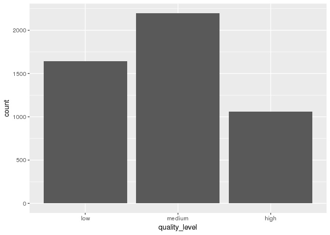

    ## 
    ##    low medium   high 
    ##   1640   2198   1060

The data contains 1640 observations of low quality wines, 2198 observations of medium quality wines and 1060 high quality of wines.

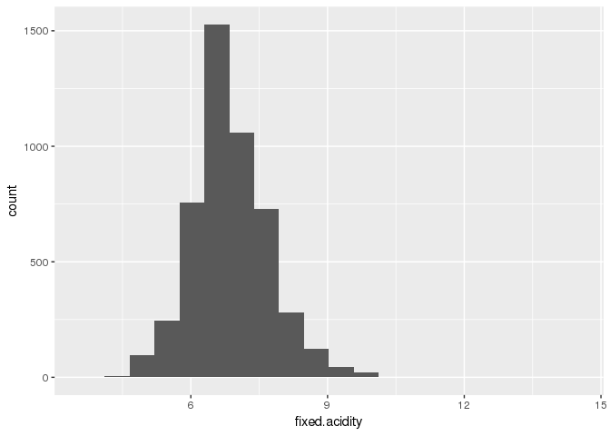

    ##    Min. 1st Qu.  Median    Mean 3rd Qu.    Max. 
    ##   3.800   6.300   6.800   6.855   7.300  14.200

Most wines have fixed acidity between 6 and 7.5 *g*/*d**m*3. There is a peak around 7 *g*/*d**m*3. Mean 6.855 *g*/*d**m*3 and median 6.80 *g*/*d**m*3; the maximum is 14.2 *g*/*d**m*3 and the minimum is 3.8 *g*/*d**m*3.

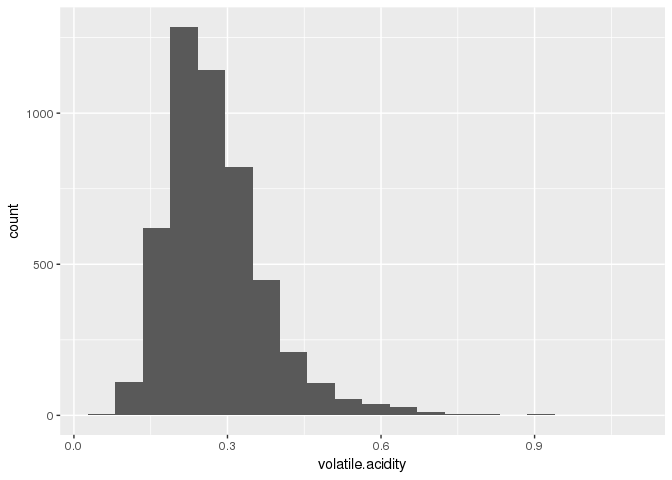

    ##    Min. 1st Qu.  Median    Mean 3rd Qu.    Max. 
    ##  0.0800  0.2100  0.2600  0.2782  0.3200  1.1000

Most wines have volatile acidity between 0.15 and 0.31 *g*/*d**m*3 approximately. The mininum value is not much less than the maxinum. A high level of this value may lead to an unpleasant taste, I will analyze it with quality later on.

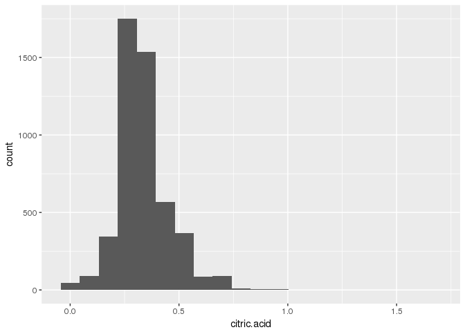

    ##    Min. 1st Qu.  Median    Mean 3rd Qu.    Max. 
    ##  0.0000  0.2700  0.3200  0.3342  0.3900  1.6600

Most wines have a citric acidity between 0.25 and 0.5 *g*/*d**m*3. The minimum value is 0.0, which means containing no citric acid. Later on I will analyze the relationship between citric acid and quality.

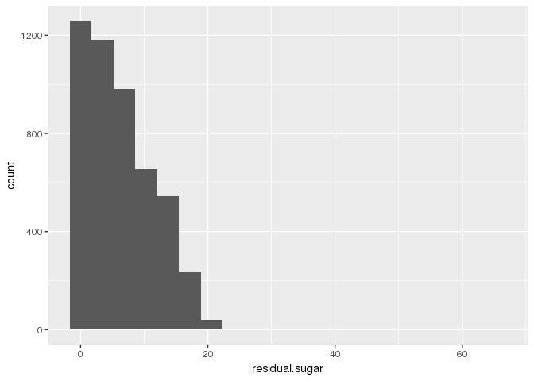

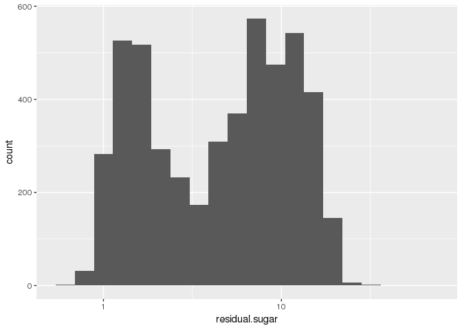

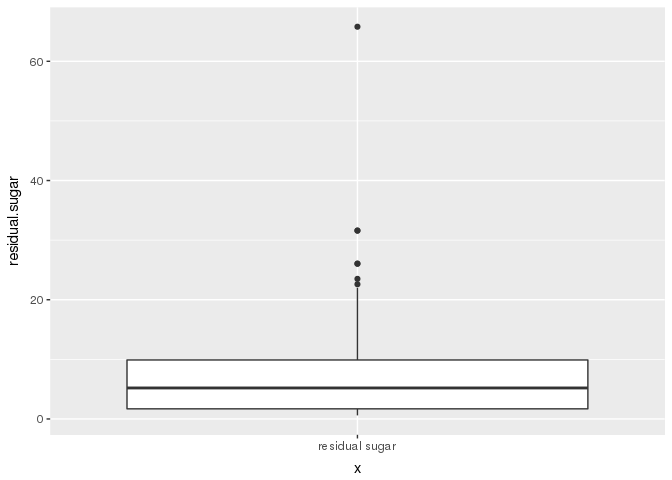

    ##    Min. 1st Qu.  Median    Mean 3rd Qu.    Max. 
    ##   0.600   1.700   5.200   6.391   9.900  65.800

The residual sugar contributes to the sweetness of wine. Because the histogram is right-skewed, I create a log-tranformed one to better observe it. Most of the wines contains residual sugar between 1 *g*/*d**m*3 and 10 *g*/*d**m*3, the log-transformed one looks bimodal, it has two peaks around 2 *g*/*d**m*3 and 9 *g*/*d**m*3 respectively, and some outliers exist. The boxplot indicates that median is around 5 and outliers have residual sugar more than 20 *g*/*d**m*3, some even has more than 60 *g*/*d**m*3, that's too sweet.

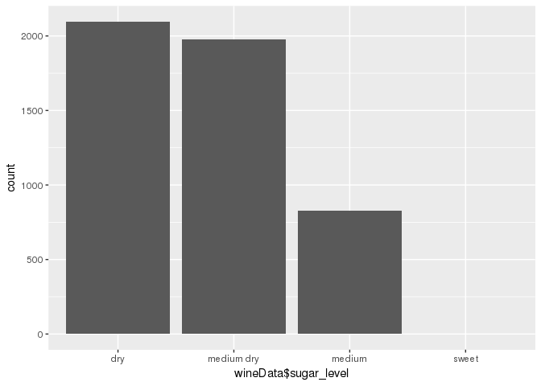

    ## 
    ##        dry medium dry     medium      sweet 
    ##       2097       1975        825          1

Most of wines are dry or medium dry, there are 825 wines of medium, and only 1 wine is sweet.

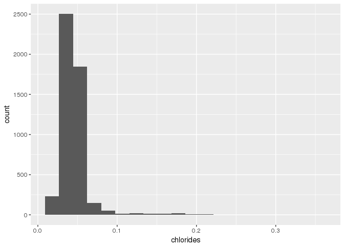

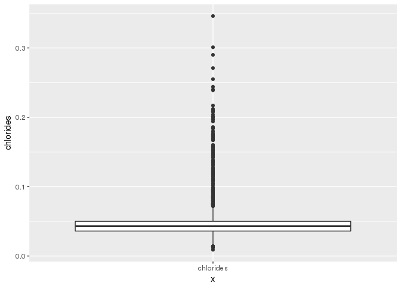

    ##    Min. 1st Qu.  Median    Mean 3rd Qu.    Max. 
    ## 0.00900 0.03600 0.04300 0.04577 0.05000 0.34600

Chlorides is the amount of salt in wine. Most wines have chlorides between 0.03 and 0.06 *g*/*d**m*3. The boxplot indicates that there are many outliers existed, the maximum value is 0.346 *g*/*d**m*3, but the variation in chlorides is small. Will a too-salty wine tastes bad? I will exlore it later on.

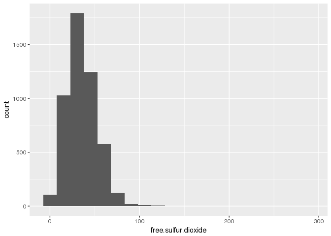

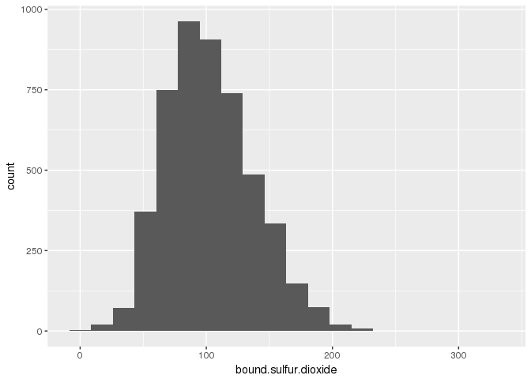

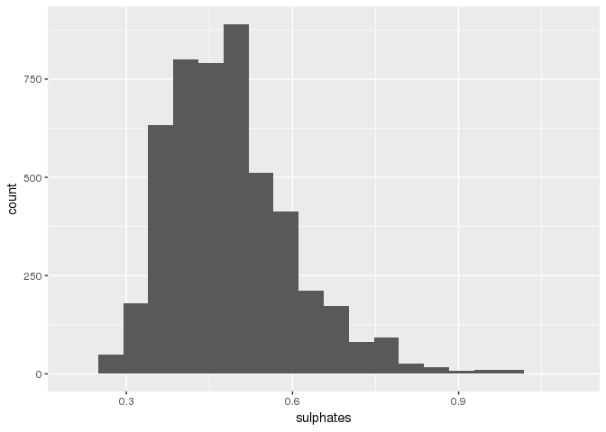

    ##  free.sulfur.dioxide bound.sulfur.dioxide   sulphates     
    ##  Min.   :  2.00      Min.   :  4.0        Min.   :0.2200  
    ##  1st Qu.: 23.00      1st Qu.: 78.0        1st Qu.:0.4100  
    ##  Median : 34.00      Median :100.0        Median :0.4700  
    ##  Mean   : 35.31      Mean   :103.1        Mean   :0.4898  
    ##  3rd Qu.: 46.00      3rd Qu.:125.0        3rd Qu.:0.5500  
    ##  Max.   :289.00      Max.   :331.0        Max.   :1.0800

Sulfur dioxide can prevent microbial growth and oxidation of wine. But it is somewhat harmful so the amount has to be limited. Most wines have free sulfur dioxide between 8 *m**g*/*d**m*3 and 50 *m**g*/*d**m*3, and bound sulfur dioxide dioxide between 70 and 150 *m**g*/*d**m*3. The maximum values of free and bound sulfur dioxide is 289 and 331 respectively. Sulphates is an additive that can keep sulfur dioxide levels, most wines have between 0.35 and 0.6 *g*/*d**m*3.

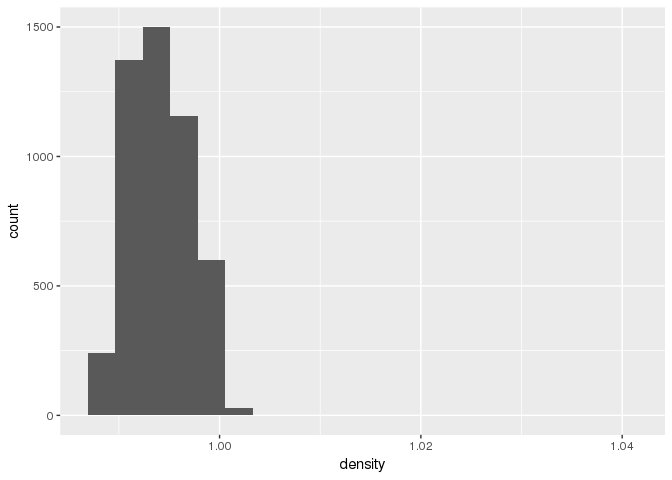

    ##    Min. 1st Qu.  Median    Mean 3rd Qu.    Max. 
    ##  0.9871  0.9917  0.9937  0.9940  0.9961  1.0390

Most wine has a density between 0.99 *g*/*c**m*3 and 1.00 *g*/*c**m*3.

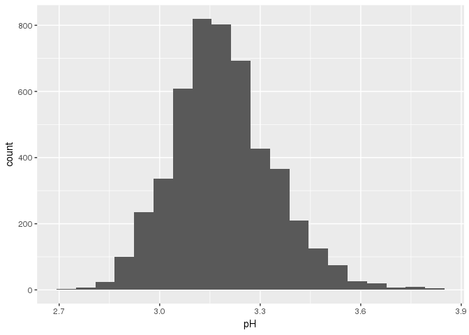

    ##    Min. 1st Qu.  Median    Mean 3rd Qu.    Max. 
    ##   2.720   3.090   3.180   3.188   3.280   3.820

All the wine is naturally acidic. And most of them are in pH 3.0-3.3; minimum 2.72, maximum 3.82, mean and median are almost the same. This may correlates to acidities above.

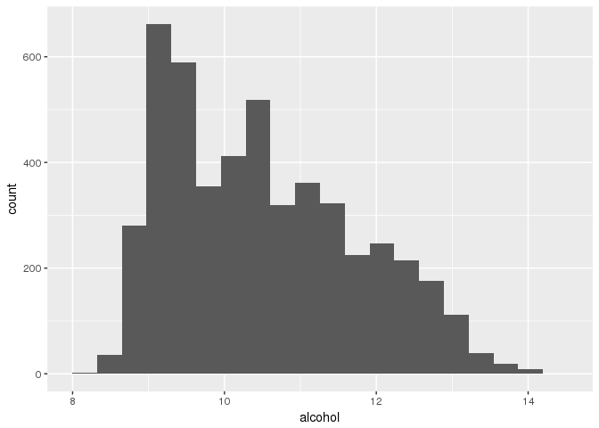

    ##    Min. 1st Qu.  Median    Mean 3rd Qu.    Max. 
    ##    8.00    9.50   10.40   10.51   11.40   14.20

Wine is a kind of low-alcohol drink. Most of them have alcohol between 9% and 12%. The minimum is 8% and the maximum is 14.2%, mean and median are 10.4% and 10.51% respectively. I guess alcohol is one of the important factors that will affect the quality.

Univariate Analysis
===================

### What is the structure of your dataset?

There are 4898 wines with 14 variables (quality, quality level, fixed acidity, volatile acidity, citric acid, residual sugar, sugar level, chlorides, free and total sulfur dioxide, sulphates, density, pH and alcohol).

quality level: low &lt; medium &lt; high sugar level: dry &lt; medium dry &lt; medium &lt; sweet

Other observations:

-   Most wines are of medium quality level;
-   The median quality is 6;
-   Most wines have fixed acidity between 6 and 7.5 *g*/*d**m*3;
-   Most wines have volatile acidity between 0.15 and 0.31 *g*/*d**m*3;
-   Most wines have citric acid between 0.25 and 0.5 *g*/*d**m*3;
-   Most wines are dry or medium dry;
-   Most wines have chlorides between 0.025 and 0.0755 *g*/*d**m*3, but many outliers existed;
-   Most wines have free sulfur dioxide below 50 *m**g*/*d**m*3 and bound sulfur dioxide 50-150 *m**g*/*d**m*3, a 0.4-0.6 *g*/*d**m*3 sulphates keep their levels;
-   Most wines are naturally acidic, around 3.0-3.3;
-   Wines are low-alcohol drinks, about 9%-12%.

### What is/are the main feature(s) of interest in your dataset?

Quality and quality level are the main features of interest in my dataset. I want to figure out how these chemical compositions affect the quality of wine.

### What other features in the dataset do you think will help support your investigation into your feature(s) of interest?

Fixed acidity, volatile acidity, citric acid, residual sugar, sugar level, chlorides, sulfur dioxide, sulphates and alcohol are likely to contribute to quality of wines.

### Did you create any new variables from existing variables in the dataset?

Yes, I create a new variable "bound.sulfur.dioxide" to divide total sulfur dioxide into two parts: the free one and the bound one, thus investigate them apartly in following explorations. And I create two categorical variables called "quality\_level" and "sugar\_level", the former is created by classifying qualities into three groups: low, medium and high; the latter is created by cutting residual sugar into four levels: dry, medium dry, medium and sweet.

### Of the features you investigated, were there any unusual distributions? Did you perform any operations on the data to tidy, adjust, or change the form of the data? If so, why did you do this?

Yes, the histogram of residual sugar is highly right-skewed, this makes it difficult to analyze. So I create a log-transformed histogram to better investigate it. The transformed distribution appears bimodal with the residual sugar peaking at both 3 and 9 *g*/*d**m*3.

Bivariate Plots Section
=======================

    ##                           quality fixed.acidity volatile.acidity
    ## quality               1.000000000   -0.11366283      -0.19472297
    ## fixed.acidity        -0.113662831    1.00000000      -0.02269729
    ## volatile.acidity     -0.194722969   -0.02269729       1.00000000
    ## citric.acid          -0.009209091    0.28918070      -0.14947181
    ## residual.sugar       -0.097576829    0.08902070       0.06428606
    ## chlorides            -0.209934411    0.02308564       0.07051157
    ## free.sulfur.dioxide   0.008158067   -0.04939586      -0.09701194
    ## bound.sulfur.dioxide -0.217867760    0.13566071       0.15676923
    ## sulphates             0.053677877   -0.01714299      -0.03572815
    ## density              -0.307123313    0.26533101       0.02711385
    ## pH                    0.099427246   -0.42585829      -0.03191537
    ## alcohol               0.435574715   -0.12088112       0.06771794
    ##                       citric.acid residual.sugar   chlorides
    ## quality              -0.009209091    -0.09757683 -0.20993441
    ## fixed.acidity         0.289180698     0.08902070  0.02308564
    ## volatile.acidity     -0.149471811     0.06428606  0.07051157
    ## citric.acid           1.000000000     0.09421162  0.11436445
    ## residual.sugar        0.094211624     1.00000000  0.08868454
    ## chlorides             0.114364448     0.08868454  1.00000000
    ## free.sulfur.dioxide   0.094077221     0.29909835  0.10139235
    ## bound.sulfur.dioxide  0.102179337     0.34484449  0.19379550
    ## sulphates             0.062330940    -0.02666437  0.01676288
    ## density               0.149502571     0.83896645  0.25721132
    ## pH                   -0.163748211    -0.19413345 -0.09043946
    ## alcohol              -0.075728730    -0.45063122 -0.36018871
    ##                      free.sulfur.dioxide bound.sulfur.dioxide   sulphates
    ## quality                     0.0081580671         -0.217867760  0.05367788
    ## fixed.acidity              -0.0493958591          0.135660713 -0.01714299
    ## volatile.acidity           -0.0970119393          0.156769227 -0.03572815
    ## citric.acid                 0.0940772210          0.102179337  0.06233094
    ## residual.sugar              0.2990983537          0.344844495 -0.02666437
    ## chlorides                   0.1013923521          0.193795498  0.01676288
    ## free.sulfur.dioxide         1.0000000000          0.263537284  0.05921725
    ## bound.sulfur.dioxide        0.2635372837          1.000000000  0.13569394
    ## sulphates                   0.0592172458          0.135693943  1.00000000
    ## density                     0.2942104109          0.504446902  0.07449315
    ## pH                         -0.0006177961          0.003143387  0.15595150
    ## alcohol                    -0.2501039415         -0.426923036 -0.01743277
    ##                          density            pH     alcohol
    ## quality              -0.30712331  0.0994272457  0.43557472
    ## fixed.acidity         0.26533101 -0.4258582910 -0.12088112
    ## volatile.acidity      0.02711385 -0.0319153683  0.06771794
    ## citric.acid           0.14950257 -0.1637482114 -0.07572873
    ## residual.sugar        0.83896645 -0.1941334540 -0.45063122
    ## chlorides             0.25721132 -0.0904394560 -0.36018871
    ## free.sulfur.dioxide   0.29421041 -0.0006177961 -0.25010394
    ## bound.sulfur.dioxide  0.50444690  0.0031433874 -0.42692304
    ## sulphates             0.07449315  0.1559514973 -0.01743277
    ## density               1.00000000 -0.0935914935 -0.78013762
    ## pH                   -0.09359149  1.0000000000  0.12143210
    ## alcohol              -0.78013762  0.1214320987  1.00000000

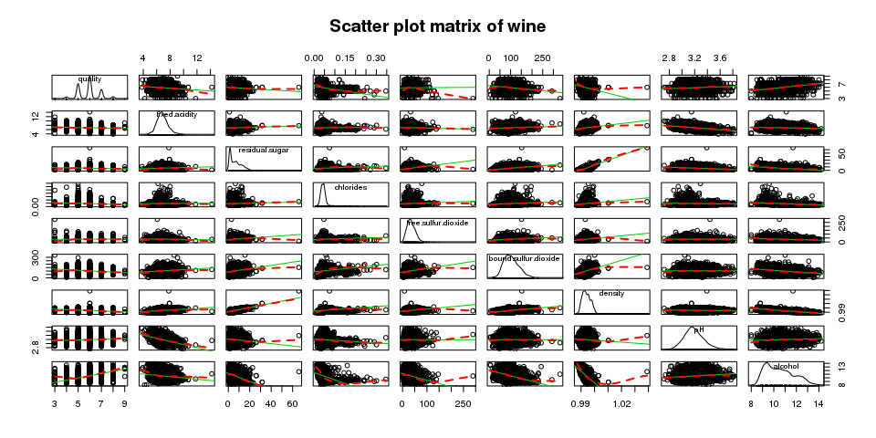

Some variables correlate with each other. Density correlates strongly with residual sugar and alcohol. All meaningful correlations are:

-   quality: density(-0.307), alcohol(0.436)
-   fixed acidity: pH(-0.43)
-   residual sugar: free sulfur dioxide(0.30), bound sulfur.dioxide(0.34), density(0.84), alcohol(-0.45)
-   chlorides: alcohol(-0.36)
-   density: bound sulfur dioxide(0.50), alcohol(-0.78)
-   alcohol: bound sulfur dioxide(-0.43)

Density and alcohol correlate with quality. I'd like to take a look at scatter plot involving them first.

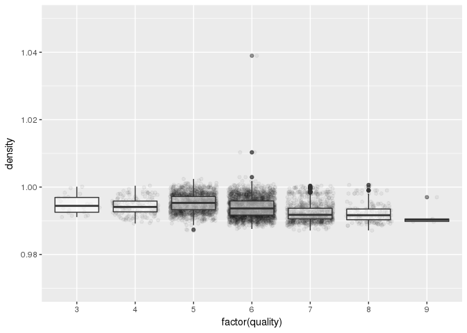

    ## wineData$quality: 3
    ##    Min. 1st Qu.  Median    Mean 3rd Qu.    Max. 
    ##  0.9911  0.9925  0.9944  0.9949  0.9969  1.0000 
    ## -------------------------------------------------------- 
    ## wineData$quality: 4
    ##    Min. 1st Qu.  Median    Mean 3rd Qu.    Max. 
    ##  0.9892  0.9926  0.9941  0.9943  0.9958  1.0000 
    ## -------------------------------------------------------- 
    ## wineData$quality: 5
    ##    Min. 1st Qu.  Median    Mean 3rd Qu.    Max. 
    ##  0.9872  0.9933  0.9953  0.9953  0.9972  1.0020 
    ## -------------------------------------------------------- 
    ## wineData$quality: 6
    ##    Min. 1st Qu.  Median    Mean 3rd Qu.    Max. 
    ##  0.9876  0.9917  0.9937  0.9940  0.9959  1.0390 
    ## -------------------------------------------------------- 
    ## wineData$quality: 7
    ##    Min. 1st Qu.  Median    Mean 3rd Qu.    Max. 
    ##  0.9871  0.9906  0.9918  0.9925  0.9937  1.0000 
    ## -------------------------------------------------------- 
    ## wineData$quality: 8
    ##    Min. 1st Qu.  Median    Mean 3rd Qu.    Max. 
    ##  0.9871  0.9903  0.9916  0.9922  0.9935  1.0010 
    ## -------------------------------------------------------- 
    ## wineData$quality: 9
    ##    Min. 1st Qu.  Median    Mean 3rd Qu.    Max. 
    ##  0.9896  0.9898  0.9903  0.9915  0.9906  0.9970

The vertical lines indicate quality values are all integers. After adding jitter, alpha and zooming the y limits, it shows that most wines' density are around 1.00 *g*/*c**m*3, median and variation don't change very much.

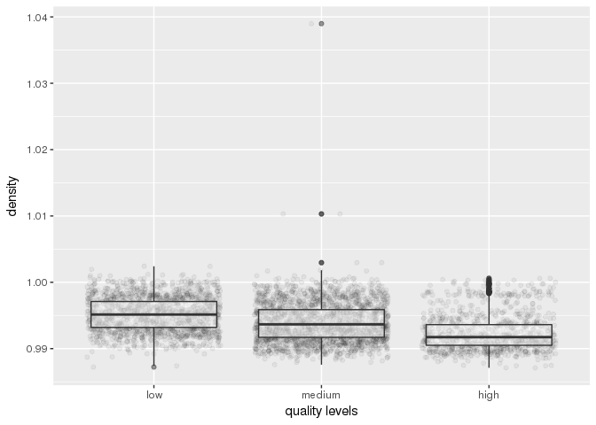

    ## wineData$quality_level: low
    ##    Min. 1st Qu.  Median    Mean 3rd Qu.    Max. 
    ##  0.9872  0.9932  0.9951  0.9952  0.9971  1.0020 
    ## -------------------------------------------------------- 
    ## wineData$quality_level: medium
    ##    Min. 1st Qu.  Median    Mean 3rd Qu.    Max. 
    ##  0.9876  0.9917  0.9937  0.9940  0.9959  1.0390 
    ## -------------------------------------------------------- 
    ## wineData$quality_level: high
    ##    Min. 1st Qu.  Median    Mean 3rd Qu.    Max. 
    ##  0.9871  0.9905  0.9917  0.9924  0.9936  1.0010

The density median decreases as the quality level improves, and the variations are all very small. Wines of high quality level tends to have more outliers than the others. Density of wines is very close to 1.00 *g*/*c**m*3.

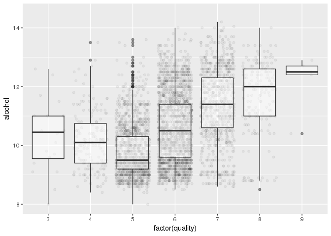

Similarly, After adding jitter, alpha and zooming the y limits, it shows that wines of quality 6 and 7 tend to have larger variations than others. Wines of best quality tend to have largest median and smallest variation. Next I'll investigate alcohol across different quality levels.

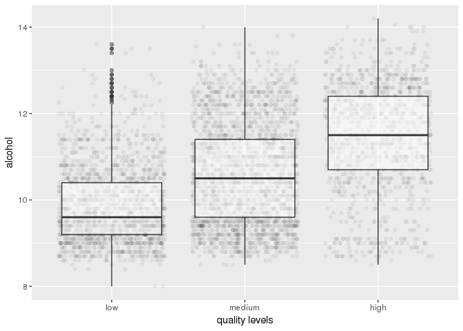

    ## wineData$quality_level: low
    ##    Min. 1st Qu.  Median    Mean 3rd Qu.    Max. 
    ##    8.00    9.20    9.60    9.85   10.40   13.60 
    ## -------------------------------------------------------- 
    ## wineData$quality_level: medium
    ##    Min. 1st Qu.  Median    Mean 3rd Qu.    Max. 
    ##    8.50    9.60   10.50   10.58   11.40   14.00 
    ## -------------------------------------------------------- 
    ## wineData$quality_level: high
    ##    Min. 1st Qu.  Median    Mean 3rd Qu.    Max. 
    ##    8.50   10.70   11.50   11.42   12.40   14.20

Low level wines have many outliers. And the alcohol median increases as the quality level improves. Wines of medium level have the biggest variation in alcohol and wines of low level have the smallest.

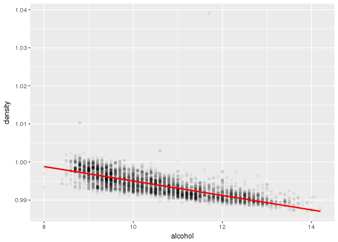

Alcohol correlates with density strongly, and the plot looks quite linear.

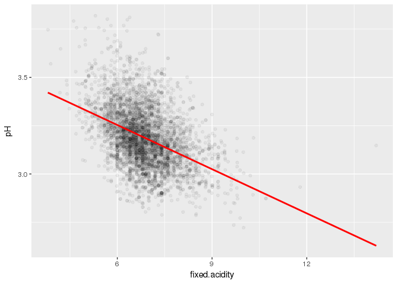

It is not surprising that fixed acidity correlates with pH, and after dealing with overplotting by adding jitter and alpha, the plot shows a meaningful-but-small correlation between them. The higher the fixed acidity, the lower the pH (more acid). So again let's take a look at fixed acidity across quality levels.

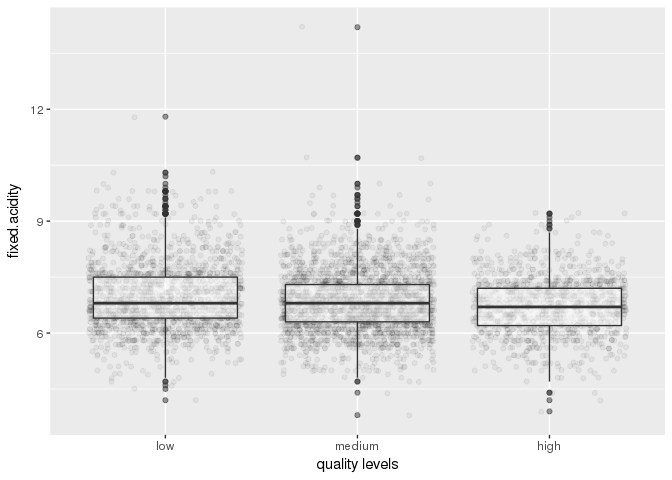

    ## wineData$quality_level: low
    ##    Min. 1st Qu.  Median    Mean 3rd Qu.    Max. 
    ##   4.200   6.400   6.800   6.962   7.500  11.800 
    ## -------------------------------------------------------- 
    ## wineData$quality_level: medium
    ##    Min. 1st Qu.  Median    Mean 3rd Qu.    Max. 
    ##   3.800   6.300   6.800   6.838   7.300  14.200 
    ## -------------------------------------------------------- 
    ## wineData$quality_level: high
    ##    Min. 1st Qu.  Median    Mean 3rd Qu.    Max. 
    ##   3.900   6.200   6.700   6.725   7.200   9.200

The higher the quality level, the less the outliers. Both the median and variation remain approximately the same across quality levels. It shows that content of fixed acidity in wines is stable.

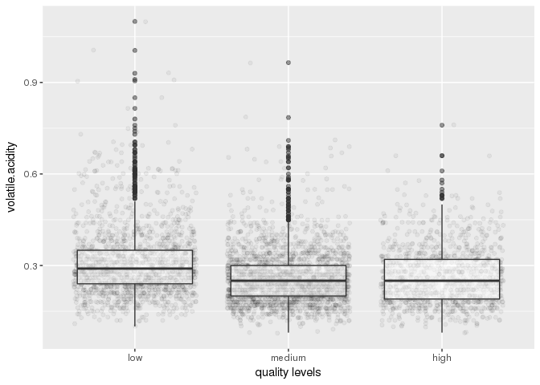

    ## wineData$quality_level: low
    ##    Min. 1st Qu.  Median    Mean 3rd Qu.    Max. 
    ##  0.1000  0.2400  0.2900  0.3103  0.3500  1.1000 
    ## -------------------------------------------------------- 
    ## wineData$quality_level: medium
    ##    Min. 1st Qu.  Median    Mean 3rd Qu.    Max. 
    ##  0.0800  0.2000  0.2500  0.2606  0.3000  0.9650 
    ## -------------------------------------------------------- 
    ## wineData$quality_level: high
    ##    Min. 1st Qu.  Median    Mean 3rd Qu.    Max. 
    ##  0.0800  0.1900  0.2500  0.2653  0.3200  0.7600

A too high of levels of volatile acidity could lead to unpleasant taste, and this is proven by the outliers in plot. More outliers appear in low quality. The variation doesn't change very much, but wines of medium and high quality tends to have median lower than those of low quality.

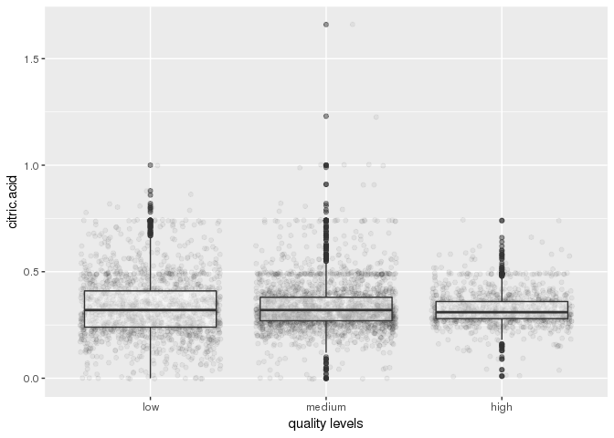

    ## wineData$quality_level: low
    ##    Min. 1st Qu.  Median    Mean 3rd Qu.    Max. 
    ##  0.0000  0.2400  0.3200  0.3343  0.4100  1.0000 
    ## -------------------------------------------------------- 
    ## wineData$quality_level: medium
    ##    Min. 1st Qu.  Median    Mean 3rd Qu.    Max. 
    ##   0.000   0.270   0.320   0.338   0.380   1.660 
    ## -------------------------------------------------------- 
    ## wineData$quality_level: high
    ##    Min. 1st Qu.  Median    Mean 3rd Qu.    Max. 
    ##  0.0100  0.2800  0.3100  0.3261  0.3600  0.7400

Citric acid is yet another factor that may affect taste, it add freshness and falvor to wines. The median doesn't change very much as the quality level improves, but the variation becomes smaller and smaller, all three quality levels have outliers.

So after analyzing three different acidities, what is pH value like across quality levels?

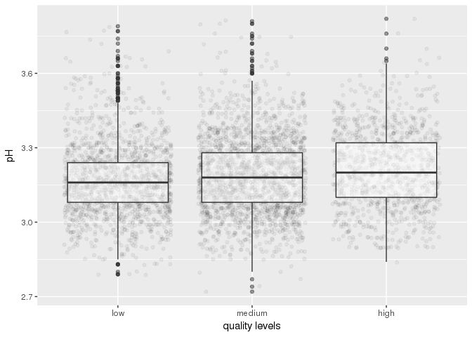

    ## wineData$quality_level: low
    ##    Min. 1st Qu.  Median    Mean 3rd Qu.    Max. 
    ##    2.79    3.08    3.16    3.17    3.24    3.79 
    ## -------------------------------------------------------- 
    ## wineData$quality_level: medium
    ##    Min. 1st Qu.  Median    Mean 3rd Qu.    Max. 
    ##   2.720   3.080   3.180   3.189   3.280   3.810 
    ## -------------------------------------------------------- 
    ## wineData$quality_level: high
    ##    Min. 1st Qu.  Median    Mean 3rd Qu.    Max. 
    ##   2.840   3.100   3.200   3.215   3.320   3.820

The median and variation in pH increases slightly as the quality level improves. High quality level tends to have less outliers than others.

Although they show no correlation with quality, but I still want to investigate what sulphates, free and bound sulfur dioxide look like across quality levels.

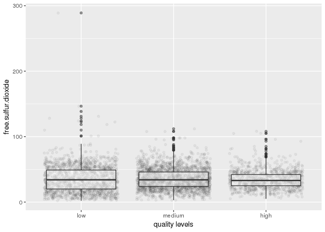

    ## wineData$quality_level: low
    ##    Min. 1st Qu.  Median    Mean 3rd Qu.    Max. 
    ##    2.00   20.00   34.00   35.34   49.00  289.00 
    ## -------------------------------------------------------- 
    ## wineData$quality_level: medium
    ##    Min. 1st Qu.  Median    Mean 3rd Qu.    Max. 
    ##    3.00   24.00   34.00   35.65   46.00  112.00 
    ## -------------------------------------------------------- 
    ## wineData$quality_level: high
    ##    Min. 1st Qu.  Median    Mean 3rd Qu.    Max. 
    ##    5.00   25.00   33.00   34.55   42.00  108.00

As the quality level improves, the median decreases slightly and the variation decreases significantly, all three levels have outliers.

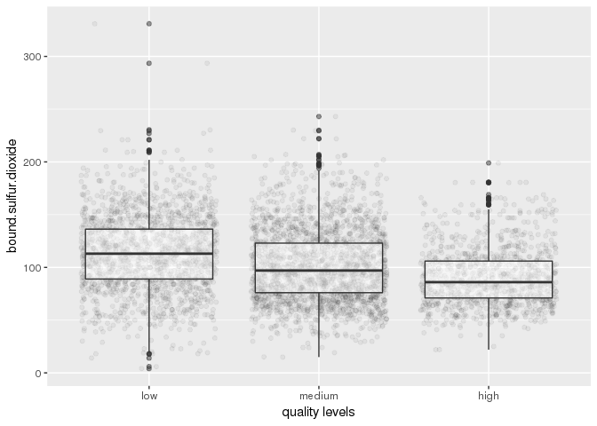

    ## wineData$quality_level: low
    ##    Min. 1st Qu.  Median    Mean 3rd Qu.    Max. 
    ##     4.0    89.0   113.0   113.3   136.2   331.0 
    ## -------------------------------------------------------- 
    ## wineData$quality_level: medium
    ##    Min. 1st Qu.  Median    Mean 3rd Qu.    Max. 
    ##    15.0    76.0    97.0   101.4   123.0   243.0 
    ## -------------------------------------------------------- 
    ## wineData$quality_level: high
    ##    Min. 1st Qu.  Median    Mean 3rd Qu.    Max. 
    ##   22.00   71.00   86.00   90.69  106.00  199.00

The median decreases as the quality level improves. And wines of high quality level have the smallest variation in bound sulfur dioxide. All three levels have outliers.

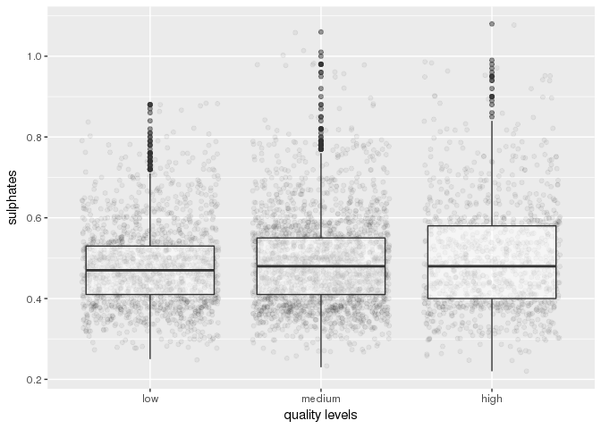

    ## wineData$quality_level: low
    ##    Min. 1st Qu.  Median    Mean 3rd Qu.    Max. 
    ##  0.2500  0.4100  0.4700  0.4815  0.5300  0.8800 
    ## -------------------------------------------------------- 
    ## wineData$quality_level: medium
    ##    Min. 1st Qu.  Median    Mean 3rd Qu.    Max. 
    ##  0.2300  0.4100  0.4800  0.4911  0.5500  1.0600 
    ## -------------------------------------------------------- 
    ## wineData$quality_level: high
    ##    Min. 1st Qu.  Median    Mean 3rd Qu.    Max. 
    ##  0.2200  0.4000  0.4800  0.5001  0.5800  1.0800

The median remains approximately the same. The variation in sulphates increases as the quality level improves. All three levels have outliers.

Next I'll consider about residual sugar. It is the amount of sugar remaining after fermentaion stops. At the very beginning I thought it might correlate with alcohol strongly but what is surprising is that it correlates with density most strongly.

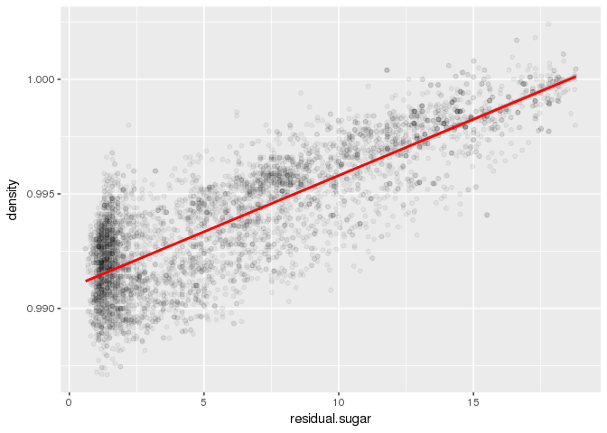

The relationship looks quite linear. Now it's time to analyze residual sugar across quality levels.

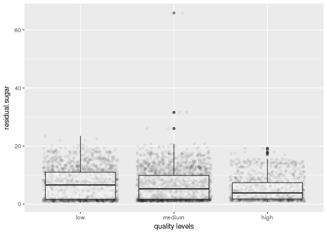

    ## wineData$quality_level: low
    ##    Min. 1st Qu.  Median    Mean 3rd Qu.    Max. 
    ##   0.600   1.700   6.625   7.054  11.020  23.500 
    ## -------------------------------------------------------- 
    ## wineData$quality_level: medium
    ##    Min. 1st Qu.  Median    Mean 3rd Qu.    Max. 
    ##   0.700   1.700   5.300   6.442   9.900  65.800 
    ## -------------------------------------------------------- 
    ## wineData$quality_level: high
    ##    Min. 1st Qu.  Median    Mean 3rd Qu.    Max. 
    ##   0.800   1.800   3.875   5.262   7.400  19.250

The median decreases significantly as the quality level improves, and the variation decreases too, indicating that the higher the quality levels, the less the residual sugar remains. Many advanced wines are dry, thus this is reasonable. Now let's take a closer look at relationships between quality levels and sugar levels, see if we can find something interesting.

From the mosaic plot we can confirm that quality levels do correlate with sugar levels. Wines of high quality tends to be dry.

    ## wineData$quality_level: low
    ##    Min. 1st Qu.  Median    Mean 3rd Qu.    Max. 
    ## 0.00900 0.04000 0.04700 0.05144 0.05300 0.34600 
    ## -------------------------------------------------------- 
    ## wineData$quality_level: medium
    ##    Min. 1st Qu.  Median    Mean 3rd Qu.    Max. 
    ## 0.01500 0.03600 0.04300 0.04522 0.04900 0.25500 
    ## -------------------------------------------------------- 
    ## wineData$quality_level: high
    ##    Min. 1st Qu.  Median    Mean 3rd Qu.    Max. 
    ## 0.01200 0.03100 0.03700 0.03816 0.04400 0.13500

The variation in chlorides remains the same, but the median decreases as the quality level improves, all three levels have outliers but high quality level is less than the others. The higher the quality level, the less salty the wines are.

Bivariate Analysis
==================

### Talk about some of the relationships you observed in this part of the investigation. How did the feature(s) of interest vary with other features in the dataset?

Density correlates with residual sugar and alcohol strongly, the former is positive, and the latter is negative.

Quality has a meaningful but small correlation with density and alcohol respectively. Density of all wines is close to 1.00 *g*/*c**m*3.

Sugar level correlates with quality level, wines of high quality tends to be dry.

Other observations:

-   Wines of high quality tends to have smallest median and variation in density;
-   Wines of high quality tends to have biggest median in alcohol;
-   Wines of high quality tends to have least outliers in fixed acidity;
-   Wines of high quality tends to have smallest median and least outliers in volatile acidity;
-   Wines of high quality tends to have smallest median and variation in citric acid, but many outliers existed;
-   Wines of high quality tends to have biggest median, variation and least outliers in pH;
-   Residual sugar of wines decreases as the quality level improves;
-   Chlorides of wines decreases slightly as the quality level improves;

Fixed acidity has a negative, meaningful but small correlation with pH, about -0.43.

### Did you observe any interesting relationships between the other features (not the main feature(s) of interest)?

Fixed acidity tends to correlate with pH value. The higher the fixed acidity, the lower the pH value.

### What was the strongest relationship you found?

The residual sugar is positively and strongly correlated with density; alcohol is negatively correlates with density but a little bit less strongly.

And if we want a better linear regression model between residual sugar and density, we must take bound sulfur dioxide and alcohol into consideration. Based on the *R*2 value, if incorporated with bound sulfur dioxide and alcohol, residual sugar explains abount 91.4% of the variance in density.

Multivariate Plots Section
==========================

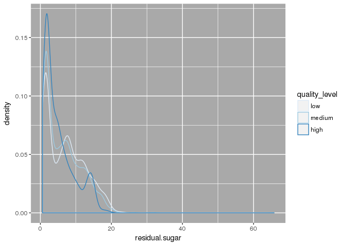

The kernel density plot shows the distributions of residual sugar under different quality levels. The higher the quality level, the more the residual sugar is limited within 10 *g*/*d**m*3.

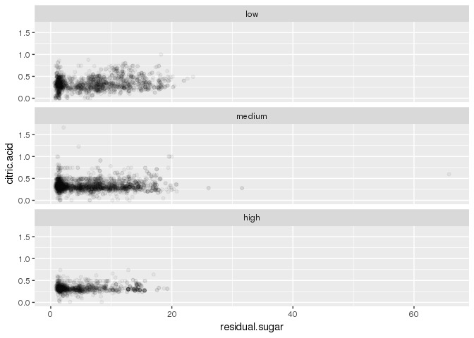

Comparing with other levels, wines of high quality level tends to have conservative residual sugar and citric acid, the corresponding plot looks more centric: residual sugar is limited within 20 *g*/*d**m*3 and most citric acid within 0.5 *g*/*d**m*3.

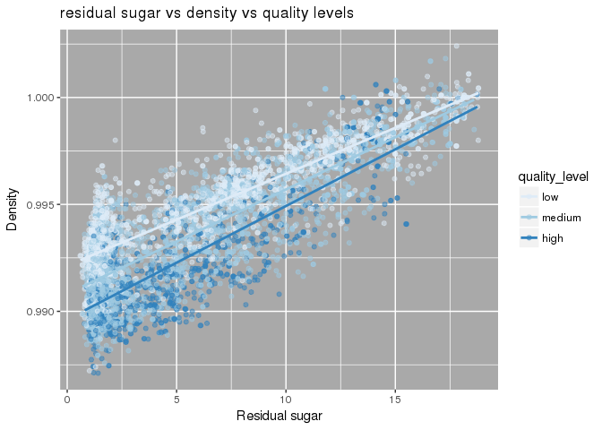

From the plot we can see that fitting lines of different quality levels are separate from each other. Let's take a look at the performance of model.

    ## 
    ## Call:
    ## lm(formula = density ~ residual.sugar, data = wineData)
    ## 
    ## Residuals:
    ##        Min         1Q     Median         3Q        Max 
    ## -0.0056862 -0.0011059  0.0001726  0.0011523  0.0155617 
    ## 
    ## Coefficients:
    ##                 Estimate Std. Error t value Pr(>|t|)    
    ## (Intercept)    9.909e-01  3.742e-05 26480.7   <2e-16 ***
    ## residual.sugar 4.947e-04  4.586e-06   107.9   <2e-16 ***
    ## ---
    ## Signif. codes:  0 '***' 0.001 '**' 0.01 '*' 0.05 '.' 0.1 ' ' 1
    ## 
    ## Residual standard error: 0.001628 on 4896 degrees of freedom
    ## Multiple R-squared:  0.7039, Adjusted R-squared:  0.7038 
    ## F-statistic: 1.164e+04 on 1 and 4896 DF,  p-value: < 2.2e-16

What we can infer from the *R*2 value is that residual sugar only explains about 70.4% of the variance in density. What about situations in different quality levels?

    ## 
    ## Call:
    ## lm(formula = density ~ residual.sugar, data = subset(wineData, 
    ##     quality_level == "low"))
    ## 
    ## Residuals:
    ##        Min         1Q     Median         3Q        Max 
    ## -0.0054151 -0.0006119  0.0000728  0.0007209  0.0049058 
    ## 
    ## Coefficients:
    ##                 Estimate Std. Error  t value Pr(>|t|)    
    ## (Intercept)    9.922e-01  5.010e-05 19804.90   <2e-16 ***
    ## residual.sugar 4.255e-04  5.685e-06    74.86   <2e-16 ***
    ## ---
    ## Signif. codes:  0 '***' 0.001 '**' 0.01 '*' 0.05 '.' 0.1 ' ' 1
    ## 
    ## Residual standard error: 0.001216 on 1638 degrees of freedom
    ## Multiple R-squared:  0.7738, Adjusted R-squared:  0.7737 
    ## F-statistic:  5604 on 1 and 1638 DF,  p-value: < 2.2e-16

For wines of low quality level, the residual sugar explains about 77.38% of the variance in density, this is a little improvement.

    ## 
    ## Call:
    ## lm(formula = density ~ residual.sugar, data = subset(wineData, 
    ##     quality_level == "medium"))
    ## 
    ## Residuals:
    ##       Min        1Q    Median        3Q       Max 
    ## -0.004504 -0.001087  0.000089  0.001112  0.015297 
    ## 
    ## Coefficients:
    ##                 Estimate Std. Error  t value Pr(>|t|)    
    ## (Intercept)    9.907e-01  5.337e-05 18564.07   <2e-16 ***
    ## residual.sugar 5.007e-04  6.464e-06    77.47   <2e-16 ***
    ## ---
    ## Signif. codes:  0 '***' 0.001 '**' 0.01 '*' 0.05 '.' 0.1 ' ' 1
    ## 
    ## Residual standard error: 0.001565 on 2196 degrees of freedom
    ## Multiple R-squared:  0.7321, Adjusted R-squared:  0.732 
    ## F-statistic:  6001 on 1 and 2196 DF,  p-value: < 2.2e-16

For wines of medium quality level, the residual sugar explains 73.21% of the variance in density, this is also a little improvement.

    ## 
    ## Call:
    ## lm(formula = density ~ residual.sugar, data = subset(wineData, 
    ##     quality_level == "high"))
    ## 
    ## Residuals:
    ##        Min         1Q     Median         3Q        Max 
    ## -0.0039636 -0.0012119 -0.0000708  0.0011311  0.0042220 
    ## 
    ## Coefficients:
    ##                 Estimate Std. Error  t value Pr(>|t|)    
    ## (Intercept)    9.896e-01  7.712e-05 12832.69   <2e-16 ***
    ## residual.sugar 5.298e-04  1.136e-05    46.64   <2e-16 ***
    ## ---
    ## Signif. codes:  0 '***' 0.001 '**' 0.01 '*' 0.05 '.' 0.1 ' ' 1
    ## 
    ## Residual standard error: 0.001586 on 1058 degrees of freedom
    ## Multiple R-squared:  0.6727, Adjusted R-squared:  0.6724 
    ## F-statistic:  2175 on 1 and 1058 DF,  p-value: < 2.2e-16

For wines of high quality level, the model becomes worse, now it's only 67.27%.

Density also correlates with alcohol strongly, next I'd like to analyze the same way as residual sugar.

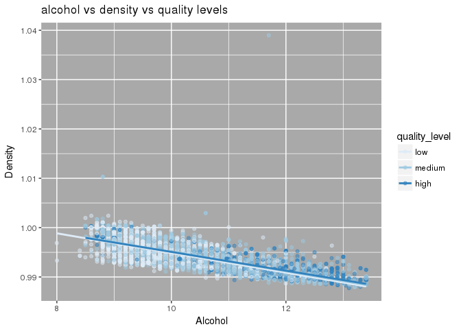

From the plot we can see that fitting lines of different quality levels are overlapping. Again I'd like to assess the availability of model.

    ## 
    ## Call:
    ## lm(formula = density ~ alcohol, data = wineData)
    ## 
    ## Residuals:
    ##       Min        1Q    Median        3Q       Max 
    ## -0.005475 -0.001238 -0.000153  0.001156  0.047201 
    ## 
    ## Coefficients:
    ##               Estimate Std. Error t value Pr(>|t|)    
    ## (Intercept)  1.014e+00  2.300e-04 4407.87   <2e-16 ***
    ## alcohol     -1.896e-03  2.173e-05  -87.25   <2e-16 ***
    ## ---
    ## Signif. codes:  0 '***' 0.001 '**' 0.01 '*' 0.05 '.' 0.1 ' ' 1
    ## 
    ## Residual standard error: 0.001871 on 4896 degrees of freedom
    ## Multiple R-squared:  0.6086, Adjusted R-squared:  0.6085 
    ## F-statistic:  7613 on 1 and 4896 DF,  p-value: < 2.2e-16

In general, alcohol explains about 60.86% of the variance in density. Will it be better under different quality levels?

    ## 
    ## Call:
    ## lm(formula = density ~ alcohol, data = subset(wineData, quality_level == 
    ##     "low"))
    ## 
    ## Residuals:
    ##        Min         1Q     Median         3Q        Max 
    ## -0.0055094 -0.0012791 -0.0002024  0.0012643  0.0072225 
    ## 
    ## Coefficients:
    ##               Estimate Std. Error t value Pr(>|t|)    
    ## (Intercept)  1.015e+00  5.224e-04 1942.36   <2e-16 ***
    ## alcohol     -1.984e-03  5.283e-05  -37.55   <2e-16 ***
    ## ---
    ## Signif. codes:  0 '***' 0.001 '**' 0.01 '*' 0.05 '.' 0.1 ' ' 1
    ## 
    ## Residual standard error: 0.001874 on 1638 degrees of freedom
    ## Multiple R-squared:  0.4626, Adjusted R-squared:  0.4623 
    ## F-statistic:  1410 on 1 and 1638 DF,  p-value: < 2.2e-16

    ## 
    ## Call:
    ## lm(formula = density ~ alcohol, data = subset(wineData, quality_level == 
    ##     "medium"))
    ## 
    ## Residuals:
    ##       Min        1Q    Median        3Q       Max 
    ## -0.004755 -0.001301 -0.000108  0.001176  0.047221 
    ## 
    ## Coefficients:
    ##               Estimate Std. Error t value Pr(>|t|)    
    ## (Intercept)  1.015e+00  3.999e-04  2537.5   <2e-16 ***
    ## alcohol     -1.959e-03  3.759e-05   -52.1   <2e-16 ***
    ## ---
    ## Signif. codes:  0 '***' 0.001 '**' 0.01 '*' 0.05 '.' 0.1 ' ' 1
    ## 
    ## Residual standard error: 0.002022 on 2196 degrees of freedom
    ## Multiple R-squared:  0.5528, Adjusted R-squared:  0.5526 
    ## F-statistic:  2715 on 1 and 2196 DF,  p-value: < 2.2e-16

For wines of low and medium quality, the model becomes worse, it can only explains about 46.26% and 55.28% of the variance in density respectively.

    ## 
    ## Call:
    ## lm(formula = density ~ alcohol, data = subset(wineData, quality_level == 
    ##     "high"))
    ## 
    ## Residuals:
    ##        Min         1Q     Median         3Q        Max 
    ## -0.0036538 -0.0011211 -0.0001381  0.0010006  0.0046187 
    ## 
    ## Coefficients:
    ##               Estimate Std. Error t value Pr(>|t|)    
    ## (Intercept)  1.014e+00  4.186e-04  2421.3   <2e-16 ***
    ## alcohol     -1.863e-03  3.645e-05   -51.1   <2e-16 ***
    ## ---
    ## Signif. codes:  0 '***' 0.001 '**' 0.01 '*' 0.05 '.' 0.1 ' ' 1
    ## 
    ## Residual standard error: 0.001489 on 1058 degrees of freedom
    ## Multiple R-squared:  0.7117, Adjusted R-squared:  0.7114 
    ## F-statistic:  2612 on 1 and 1058 DF,  p-value: < 2.2e-16

However, this model is better for wines of high quality, now *R*2 improves to 0.7117, meaning that the model can explain about 71.17% of the variance in density.

I am not very content with these values. Trying to create models about density by just residual sugar or alcohol alone is not ideal. There must be a comprehensive model including more variables. By checking the correlation matrix again, I finally realize that there is a complex correlation existed for a variety of variables:

1.  quality correlates with density and alcohol meaningfully but small;
2.  density correlates with residual sugar and alcohol strongly;
3.  density correlates with bound sulphur dioxide moderately;

So is it possible to create a better model by incorporating them all? Let's try this!

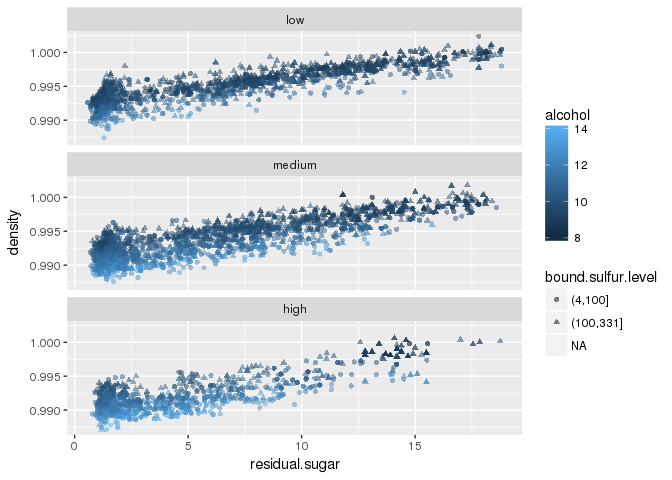

    ## 
    ## Call:
    ## lm(formula = density ~ residual.sugar + bound.sulfur.dioxide + 
    ##     alcohol, data = wineData)
    ## 
    ## Residuals:
    ##        Min         1Q     Median         3Q        Max 
    ## -0.0019652 -0.0005595 -0.0001188  0.0004151  0.0251295 
    ## 
    ## Coefficients:
    ##                        Estimate Std. Error t value Pr(>|t|)    
    ## (Intercept)           1.003e+00  1.516e-04 6613.99   <2e-16 ***
    ## residual.sugar        3.495e-04  2.812e-06  124.28   <2e-16 ***
    ## bound.sulfur.dioxide  8.536e-06  4.055e-07   21.05   <2e-16 ***
    ## alcohol              -1.144e-03  1.203e-05  -95.10   <2e-16 ***
    ## ---
    ## Signif. codes:  0 '***' 0.001 '**' 0.01 '*' 0.05 '.' 0.1 ' ' 1
    ## 
    ## Residual standard error: 0.000875 on 4894 degrees of freedom
    ## Multiple R-squared:  0.9145, Adjusted R-squared:  0.9144 
    ## F-statistic: 1.744e+04 on 3 and 4894 DF,  p-value: < 2.2e-16

And yes! The *R*2 improves to 0.9145, which means that residual sugar, together with bound sulfur dioxide and alcohol, explains 91.4% of the variance in density. It's much better now. Let's again take a look at situations of different quality levels.

    ## 
    ## Call:
    ## lm(formula = density ~ residual.sugar + bound.sulfur.dioxide + 
    ##     alcohol, data = subset(wineData, quality_level == "low"))
    ## 
    ## Residuals:
    ##        Min         1Q     Median         3Q        Max 
    ## -0.0022223 -0.0005664 -0.0001161  0.0003927  0.0041577 
    ## 
    ## Coefficients:
    ##                        Estimate Std. Error t value Pr(>|t|)    
    ## (Intercept)           1.002e+00  3.031e-04 3304.59   <2e-16 ***
    ## residual.sugar        3.380e-04  4.399e-06   76.84   <2e-16 ***
    ## bound.sulfur.dioxide  7.744e-06  6.175e-07   12.54   <2e-16 ***
    ## alcohol              -9.849e-04  2.700e-05  -36.48   <2e-16 ***
    ## ---
    ## Signif. codes:  0 '***' 0.001 '**' 0.01 '*' 0.05 '.' 0.1 ' ' 1
    ## 
    ## Residual standard error: 0.0008331 on 1636 degrees of freedom
    ## Multiple R-squared:  0.894,  Adjusted R-squared:  0.8938 
    ## F-statistic:  4597 on 3 and 1636 DF,  p-value: < 2.2e-16

    ## 
    ## Call:
    ## lm(formula = density ~ residual.sugar + bound.sulfur.dioxide + 
    ##     alcohol, data = subset(wineData, quality_level == "medium"))
    ## 
    ## Residuals:
    ##        Min         1Q     Median         3Q        Max 
    ## -0.0018633 -0.0005870 -0.0001003  0.0004299  0.0237181 
    ## 
    ## Coefficients:
    ##                        Estimate Std. Error t value Pr(>|t|)    
    ## (Intercept)           1.002e+00  2.568e-04 3902.66   <2e-16 ***
    ## residual.sugar        3.718e-04  4.502e-06   82.59   <2e-16 ***
    ## bound.sulfur.dioxide  9.196e-06  6.475e-07   14.20   <2e-16 ***
    ## alcohol              -1.098e-03  2.077e-05  -52.84   <2e-16 ***
    ## ---
    ## Signif. codes:  0 '***' 0.001 '**' 0.01 '*' 0.05 '.' 0.1 ' ' 1
    ## 
    ## Residual standard error: 0.0009589 on 2194 degrees of freedom
    ## Multiple R-squared:  0.8996, Adjusted R-squared:  0.8994 
    ## F-statistic:  6550 on 3 and 2194 DF,  p-value: < 2.2e-16

For wines of low and medium quality, this model become less effective, but can still explain about 89% of the variance in density.

    ## 
    ## Call:
    ## lm(formula = density ~ residual.sugar + bound.sulfur.dioxide + 
    ##     alcohol, data = subset(wineData, quality_level == "high"))
    ## 
    ## Residuals:
    ##        Min         1Q     Median         3Q        Max 
    ## -1.666e-03 -4.867e-04 -7.105e-05  3.685e-04  2.577e-03 
    ## 
    ## Coefficients:
    ##                        Estimate Std. Error t value Pr(>|t|)    
    ## (Intercept)           1.004e+00  2.679e-04 3746.84   <2e-16 ***
    ## residual.sugar        3.265e-04  5.865e-06   55.67   <2e-16 ***
    ## bound.sulfur.dioxide  9.809e-06  8.841e-07   11.09   <2e-16 ***
    ## alcohol              -1.228e-03  1.973e-05  -62.23   <2e-16 ***
    ## ---
    ## Signif. codes:  0 '***' 0.001 '**' 0.01 '*' 0.05 '.' 0.1 ' ' 1
    ## 
    ## Residual standard error: 0.0006784 on 1056 degrees of freedom
    ## Multiple R-squared:  0.9403, Adjusted R-squared:  0.9401 
    ## F-statistic:  5540 on 3 and 1056 DF,  p-value: < 2.2e-16

For wines of high quality, it improves again! Now this model can explain about 94.03% of the variance in density. These features strengthened each other in terms of this quality level.

Multivariate Analysis
=====================

### Talk about some of the relationships you observed in this part of the investigation. Were there features that strengthened each other in terms of looking at your feature(s) of interest?

Although correlated strongly, the model is not very ideal if creating with density and only one feature(residual sugar or alcohol) alone, it will be even worse under some of the quality levels. By checking features that correlates with each other strongly or moderately, I finally create a new model that is much better. Especially under the high quality level, density, residual sugar, alcohol and bound sulfur dioxide strengthened each other.

### Were there any interesting or surprising interactions between features?

Yes, residual sugar and citric acid tend to be more conservative in wines of high quality, this is reasonable for residual sugar because sugar level correlates with quality level. What is surprising is that although citric acid can add freshness and flavor to wines, it is not "the more the better".

### OPTIONAL: Did you create any models with your dataset? Discuss the strengths and limitations of your model.

Yes, after doing some explorations and looking at relationships between different features. I create a model of density by taking residual sugar, alcohol and bound sulphur dioxide into account. It explains 91.4% of the variance in density in general. This model has limitations, it explains better under high quality level(about 94.03%), in levels of low and medium, it becomes worse, but can still explain about 89%.

------------------------------------------------------------------------

Final Plots and Summary
=======================

### Plot One

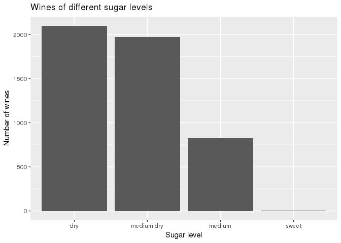

### Description One

Most wines are of dry and medium dry, there are more than 750 wines of medium, and wines of sweet are very rare.

### Plot Two

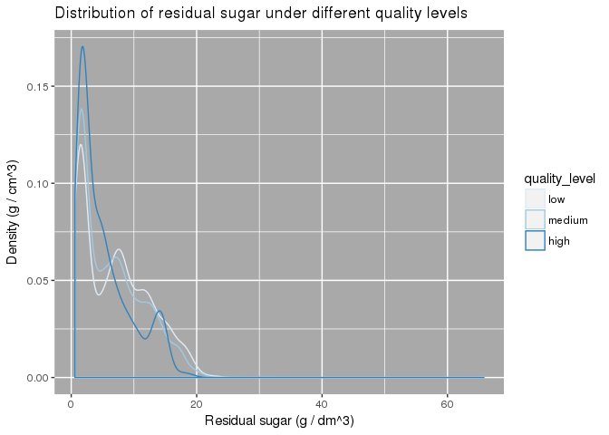

### Description Two

A large proportion of residual sugar is within 10 *g*/*d**m*3 under high quality level. When the quality level goes down, this proportion becomes smaller and smaller. Wines of higher quality tend to have less residual sugar.

### Plot Three

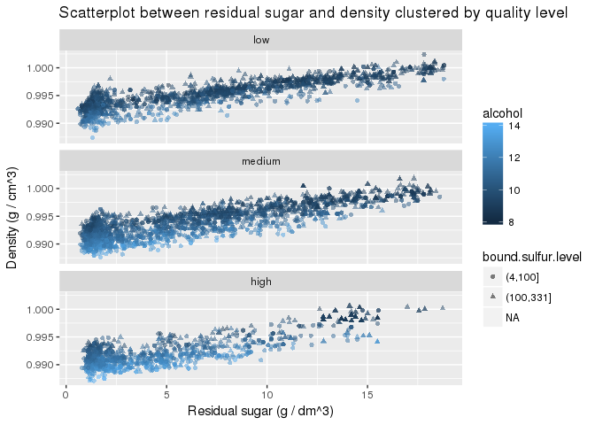

### Description Three

These are scatterplots of residual sugar and density clustered by quality levels. The shade of color indicates the content of alcohol, and the shapes represent different levels of contents of bound sulfur dioxide. They indicate that a linear model could be constructed to predict density using residual sugar as the predictor variable. Holding residual sugar constant, wines with less alcohol and more bound sulful dioxide almost always have larger density.

------------------------------------------------------------------------

Reflection
==========

This dataset is about white wines, containing 4898 observations of 13 variables. Although none of the observations contain NAs. But it lacks of categorical variables. So I create two new categorical variables called sugar\_level and quality\_level. I also create a new variable to retrieve bound sulfur dioxide from total sulfur dioxide by free sulfur dioxide.

I begin my exploration by investigating indiviual variables, trying to figure out their distributions by histograms, count the number of wines by different levels.

Then I create a correlation and scatterplots matrix to see if there are some correlations between variables. I was surprised at the beginning that there's no strong correlations between quality and other chemicals, only to find some small correlations with density and alcohol. But density do correlates with residual sugar and alcohol strongly, with bound sulfur dioxide moderately, so I investigate some related variables with quality levels. Then I explore the relathionships between the two categorical variables by mosaic plot, finding that sugar level correlates with quality level to some extent. This is an important clue for further exploration.

Because quality correlates with density and alcohol small, and density correlates with alcohol and residual sugar strongly, with bound sulphur dioxide moderately, I focus on these features in multivariate section. At first I take a look at kernel density plot of residual sugar under different quality levels. Secondly, I investigate residual sugar and citric acid, which may add freshness and flavor to wines, under different quality levels too. At last, I try to create a model to predict density by alcohol or residual sugar alone, assessing the model in different quality levels only to find that it is not very ideal. Then I realize that only one or two features are not enough, so I take related 3 features into account and finally get a better model which is able to account for 91.45% of the variance in density, and a 94.03% under high quality level. One major limitation is that this model becomes worse when it comes to low and medium level, but can still explain about 89%.

One of the limitations of the dataset is that it is too small to have only 4898 observations. Maybe with a much larger dataset we can find more interesting things or stronger correlations. And when the number of variables becomes larger and larger, it is difficult to find the inner relationships by just doing data analysis, maybe we need some advanced techniques such as machine learning(even deep learning). So the future work includes collecting more data and more variables, finding another dataset about red wines and then doing a joint analysis, or applying some machine learning techniques to help us figure out deeply hidden patterns and so on.
